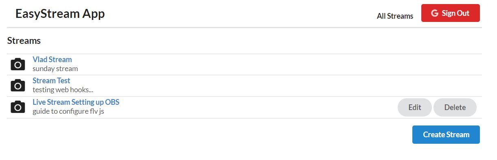
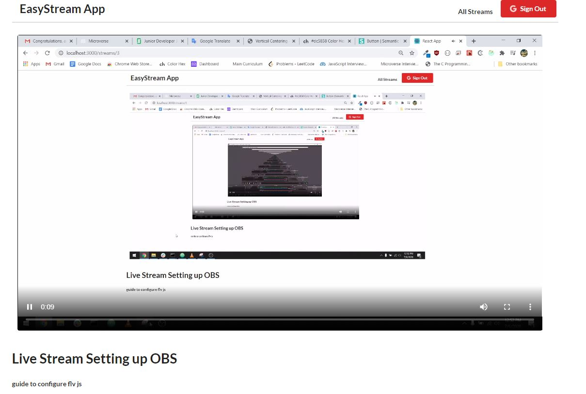

## Stream Service App

This application allows users to sign in with their google account and create/edit/delete and view live streams.  
It implements a RESTFul API with JSONServer, a RTMP Server to facilitate the connection with [flv.js](https://github.com/Bilibili/flv.js/), allowing easy stream configurations through web hooks and flash video player.  
The application was tested using OBS(Open Broadcaster Software).  
Users are able to create and setup an easy stream connection with the RTMP server by using the stream id as the stream key.  
<b>Example</b>
```
rtmp://localhost/live/:id
```

## Built With

- ReactJS (Frontend)
- Redux (State Management)
- Redux-Thunk (Middleware)
- React Router (Route Handling)
- JSONServer (Backend API)
- flv.js (Video Player)
- NodeMediaServer (Real Time Messaging Protocol)
- Semantic CSS (Styling)

## App Screenshots




## Setup instructions

Open a terminal window, go to the location you'd like to add the project and then run the commands below.

### Clone Repository

```console
git clone https://github.com/noomdalv/redux_streams.git
```

### Setup NodeMediaServer or RTMP Server

Go to the /rtmpserver folder inside redux_streams and type:
```console
npm start
```

### Setup JSONServer API

In your terminal, go to the api directory within the created redux_streams folder and install dependencies with:
```console
npm install
```
and start the server with:
```console
npm start
```

### Setup Client
In your terminal, go to the client directory within the created redux_streams folder and install dependencies with:
```console
npm install
```
Finally, start the server with:
```console
npm start
```

## Special Thanks to [Stephen Grider](https://www.udemy.com/course/react-redux/) for his amazing tutorial.

## Author

👤 **Vladimir Luna**

- Github: [@noomdalv](https://github.com/noomdalv)


## 📝 License

This project is [MIT](lic.url) licensed.
